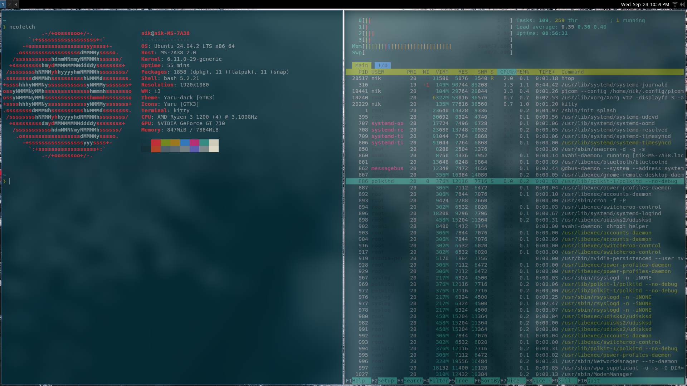
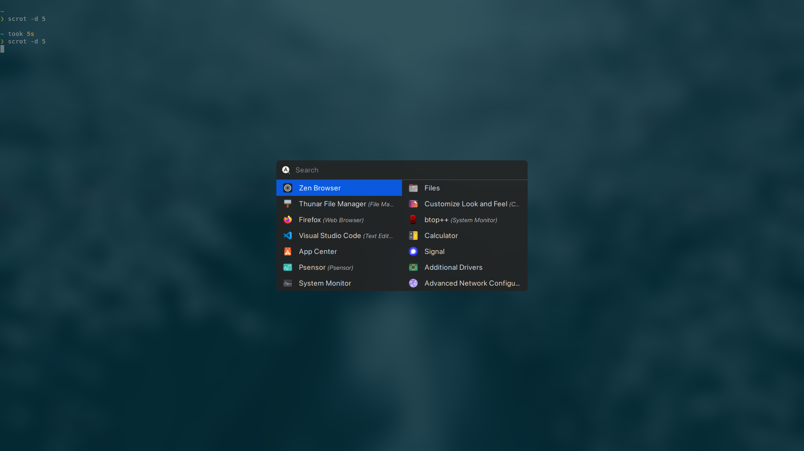
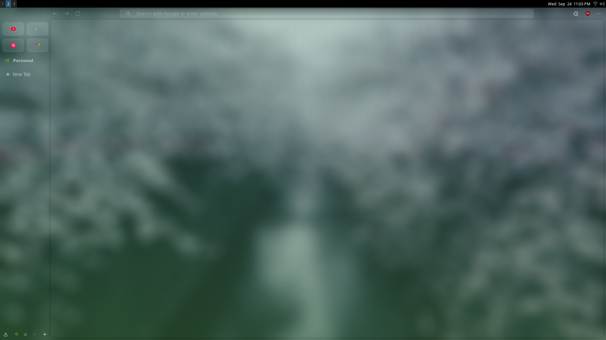
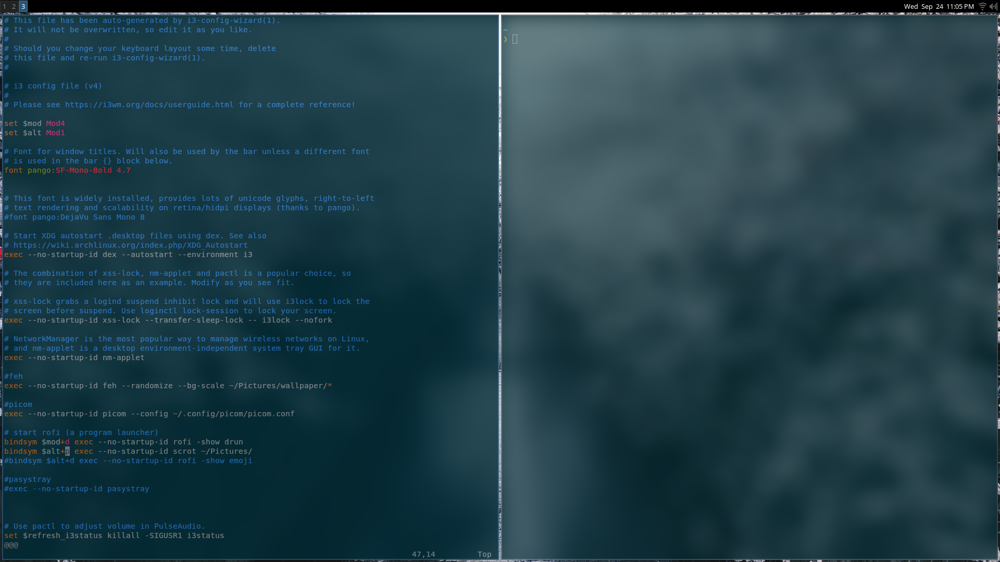
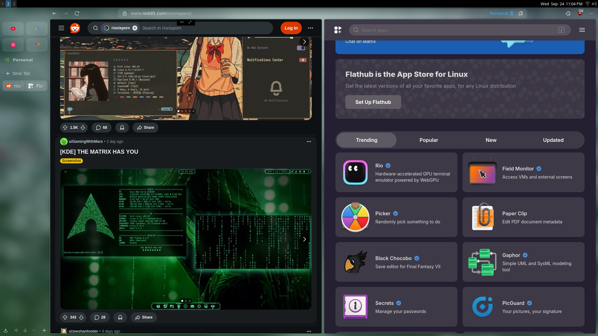

# My Dotfiles ✨

A highly curated, aesthetic, and keyboard-driven Linux setup for ultimate productivity. This repository contains my personal configuration files, built with reusability and a modern look in mind. The core of this setup is the blazing-fast **i3 Window Manager**.

---

## Acknowledgements

A huge thank you to the creators and maintainers of all the open-source software that makes this possible. This setup is heavily inspired by the amazing ricing community over at [r/unixporn](https://www.reddit.com/r/unixporn/).

## A Symphony of Pixels & Productivity

The philosophy behind this setup is simple: create a beautiful, distraction-free environment that gets out of your way and lets you focus on what's important. Every component is chosen to be lightweight, fast, and controlled primarily by the keyboard, minimizing the need for mouse interaction and maximizing efficiency.

## What's Inside? 📦

This setup is a collection of carefully configured applications that work together seamlessly.

| Category                | Application                                                                   | Description                                                          |
| ----------------------- | ----------------------------------------------------------------------------- | -------------------------------------------------------------------- |
| **Window Manager** | [i3-gaps](https://github.com/Airblader/i3)                                    | The heart of the setup; a fast, tiling window manager with gaps.     |
| **Status Bar** | [i3bar](https://i3wm.org/docs/i3bar-protocol.html)                            | The simple and efficient default bar for i3.                         |
| **Application Launcher**| [Rofi](https://github.com/davatorium/rofi)                                    | A customized launcher, window switcher, and emoji selector.          |
| **Terminal** | [Kitty](https://sw.kovidgoyal.net/kitty/)                                     | A fast, feature-rich, GPU-based terminal emulator.                   |
| **Terminal Multiplexer**| [Tmux](https://github.com/tmux/tmux)                                          | For managing multiple persistent terminal sessions.                  |
| **Text Editor** | [Neovim](https://neovim.io/)                                                  | The ultimate, modern Vim-based text editor.                          |
| **Compositor** | [Picom](https://github.com/yshui/picom)                                       | For transparency, drop shadows, and smooth animations.               |
| **Notification Daemon** | [Dunst](https://github.com/dunst-project/dunst)                               | A lightweight and customizable notification daemon.                  |
| **File Manager** | [Thunar](https://docs.xfce.org/xfce/thunar/start)                             | A modern, fast, and easy-to-use graphical file manager.              |
| **Lockscreen** | [betterlockscreen](https://github.com/betterlockscreen/betterlockscreen)      | A beautiful and feature-rich `i3lock` wrapper.                       |
| **Wallpaper Manager** | [Feh](https://feh.finalrewind.org/)                                           | A lightweight image viewer used to set desktop wallpapers.           |
| **System Info** | [Neofetch](https://github.com/dylanaraps/neofetch)                            | For displaying system information in a stylish way.                  |
| **Font** | [SF Pro Display](https://developer.apple.com/fonts/)                          | Apple's clean and modern font used for UI and titles.                |

## Features 🚀

* **Aesthetic & Minimal:** Clean lines, a coherent color scheme, and pleasing gaps between windows.
* **Keyboard First:** A mouse-free workflow with intuitive and ergonomic keybindings.
* **Productivity Focused:** Streamlined for development, writing, and system administration with minimal distractions.
* **Reusable & Simple:** Designed to be easily installed on a new system.
* **Lightweight:** Low on system resources, ensuring a snappy and responsive experience.

## Keybindings Cheatsheet ⌨️

Here are some of the essential keybindings to get you started. `$mod` is set to the `Super` (Windows) key.

| Keybinding               | Action                                   |
| ------------------------ | ---------------------------------------- |
| `$mod + Enter`           | Open a new terminal (Kitty)              |
| `$mod + Shift + q`       | Close the focused window                 |
| `$mod + d`               | Open application launcher (Rofi)         |
| `$mod + [h,j,k,l]`       | Move focus (Vim-style)                   |
| `$mod + Shift + [h,j,k,l]` | Move the focused window                  |
| `$mod + [1,2,3...]`      | Switch to workspace N                    |
| `$mod + Shift + [1,2,3...]`| Move focused window to workspace N     |
| `$mod + Shift + r`       | Restart i3 in place                      |
| `$mod + Shift + e`       | Exit i3 session (logout)                 |
| `$mod + r`               | Enter resize mode                        |

ScreenShots of the Setup

---

